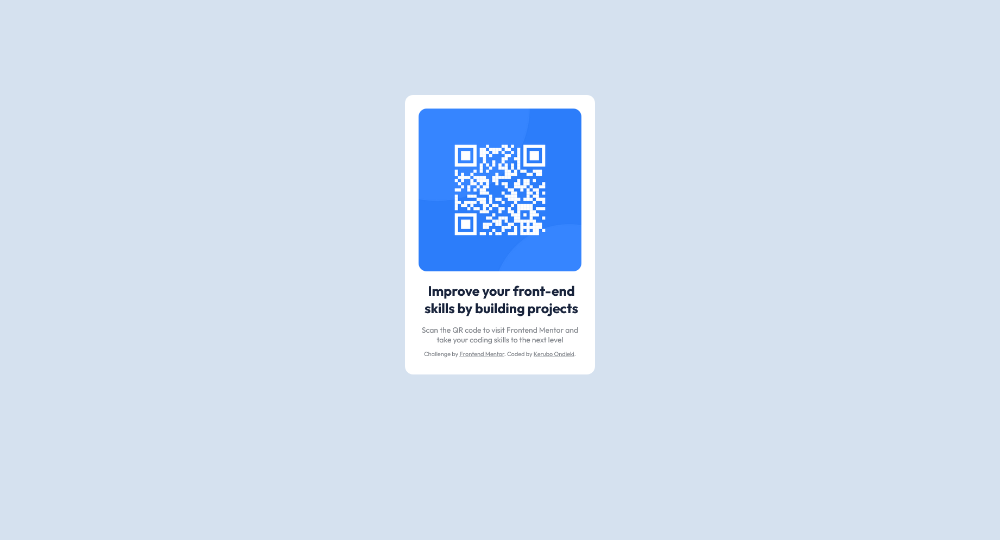

# Frontend Mentor - QR code component solution

This is a solution to the [QR code component challenge on Frontend Mentor](https://www.frontendmentor.io/challenges/qr-code-component-iux_sIO_H).

## Table of contents

- [Overview](#overview)
  - [Screenshot](#screenshot)
  - [What I learned](#what-i-learned)
  - [Useful resources](#useful-resources)
- [Author](#author)


## Overview

### Screenshot




### What I learned

Laying down HTML is quick and simple but the CSS of it all is usually the headache for any web developer. But i managed to finally center the qr code:


```css
.sticker {
    background: #ffff;
    margin-left: auto;
    margin-right: auto;
    margin-top: 175px;
    display: block;
    height: 490px;
    width: 350px;
    padding-top: 25px;
    border-radius: 15px;
    text-align: center;
}
```

It's fairly simple code, but it was gratifying to finally get the positioning right.


### Useful resources

- [W3schools](https://www.w3schools.com/default.asp) - This helped me with refreshing on HTML and CSS syntax.


## Author

- Website - [Add your name here](https://www.your-site.com)
- Frontend Mentor - [@kuhblam](https://www.frontendmentor.io/profile/kuhblam)
